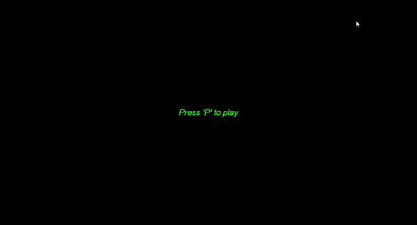

# Chopper-2D

A simple 2D platform style mini game using the DirectX SDK. Developed in 2011 when studying Diploma of Software Development.

  

  

## Overview

Fly a helicopter through an asteroid field in space. The objective is to get through the asteroid belt safely.

  

## Getting Started

These instructions will get your clone of Chopper-2D up and running on your local machine for development.

  

### Prerequisites

  

*  [Visual Studio](https://visualstudio.microsoft.com/)

*  [Desktop development with C++ Tools](https://docs.microsoft.com/en-us/cpp/build/vscpp-step-0-installation?view=vs-2017)

*  [DirectX Software Development Kit](https://www.microsoft.com/en-au/download/details.aspx?id=6812)

  

### Running the project locally

  

* Open the solution in Visual Studio and `Target x86` - then Hit `F5` 🎉🎉🎈

####  __If you have compile error__ 😥

  

1. Right click the Chopper project in the Solution Explorer and click `Properties`

2. Navigate to `VC++ Directories`

3. Under `General` make sure your VC++ Include and Library Directories are referencing the correct install location of the [DirectX Software Development Kit](https://www.microsoft.com/en-au/download/details.aspx?id=6812)

|  |  |
|--|--|
| Include Directories | C:\Program Files (x86)\Microsoft DirectX SDK (June 2010)\Include;$(IncludePath) |
| Library Directories | C:\Program Files (x86)\Microsoft DirectX SDK (June 2010)\Lib\x86;$(LibraryPath)

  

## Authors

  

*  **Sean O'Loughlin** - [SeanoNET](https://github.com/SeanoNET)

  

## License

  

This project is licensed under the MIT License - see the [LICENSE.md](LICENSE) file for details
